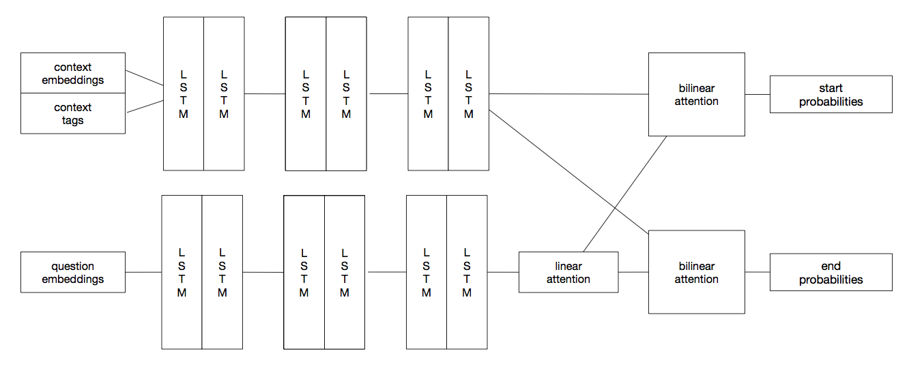

# SQuAD
### Куканов Виктор, БПМИ-165

## Описание задачи и обзор существующих подходов

[SQuAD](https://rajpurkar.github.io/SQuAD-explorer/) — датасет, содержащий набор статей в паре с вопросами и ответами. Главной целью является создание алгоритма, способного "прочитать" статью и вопрос к ней, а после этого сгенерировать ответ на поставленный вопрос (в данном случае ответом является какая-то подстрока в статье).

На данный момент активно развиваются методы по обработке естественного языка в связи с высокой прикладной значимостью этой области. С момента создания датасета SQuAD было предложено множество алгоритмов, решающих задачу по построению релеватного ответа на вопрос по статье:
* [Reinforced Mnemonic Reader for Machine Reading Comprehension](https://arxiv.org/pdf/1705.02798.pdf)
* [R-NET: machine reading comprehension with self-matching networks](https://www.microsoft.com/en-us/research/wp-content/uploads/2017/05/r-net.pdf)
* [Stochastic Answer Networks for Machine Reading Comprehension](https://arxiv.org/pdf/1712.03556.pdf)
* [FUSIONNET: fusing via fully-aware attention with application to machine comprehension](https://arxiv.org/pdf/1711.07341.pdf)

Каждое представленное выше решение в плотную приблизилось по точности ответов к человеку.

## Процесс работы над проектом

Первые два месяца были посвящены введению в машинное обучение. За это время были изучены различные задачи обучения с учителем и методы их решения. В первой лабораторной работе рассмотрены и реализованы линейные модели для регрессии и классификации, а также различные вариации градиентного спуска (Adadelta, Adam, RMSProp и другие). 

Далее было введение в нейронные сети на примере задачи классификации рукописных цифр из датасета [MNIST](http://yann.lecun.com/exdb/mnist/). Сперва был использован однослойный, а затем многослойный перцептрон. Изучен и применён метод обратного распространения ошибки.

Следующая лабораторная работа была посвящена свёрточным сетям. В процессе работы над распознаванием рукописных иероглифов рассмотрены актуальные архитектуры сверточных сетей (Res-NET, Inception, VGG-NET).

Дальнейшее обучение было связано с обработкой естественного языка. Сперва были изучены методы построения векторых представлений слов (Word2Vec, GloVe, FastText). Далее рассмотрены рекурентные сети и способы их применения при работе с текстовыми данными на примере задачи по построению транскрипций слов.

Последним этапом стало изучение подходов и статей для реализации модели, способной отвечать на вопросы по тексту.

## Реализация

Моя реализация алгоритма основана на статье [Reading Wikipedia to Answer Open-Domain Questions](http://www-cs.stanford.edu/people/danqi/papers/acl2017.pdf).
Обработка данных и сама модель написана на языке Python (самый распространенный и наиболее удобный язык для решения задач машинного обучения). Для реализации нейронной сети был использован фреймворк Keras (предоставляет интуитивно понятный и максимально гибкий интерфейс для работы с нейронными сетями).

Наглядная визуализация архитектуры сети:

## Инструкция

1. Для корректной работы требуется python версии не ниже 3.5. 
2. Для начала нужно установить все необходимые библиотеки. Это можно сделать с помощью команды  `pip3 install -r requirements.txt`.
3. Далее необходимо загрузить данные/модель. Все данные будут сохранены в папку `data`.
- 3.1. Для работы в режиме демонстрации необходимо выполнить `sudo python3 prepare.py -demo`
- 3.2. Для того, чтобы обучить модель с нуля или протестировать качество на валидационной выборке уже существующей модели, необходимо выполнить `sudo python3 prepare.py -full` (это займет существенно больше времени, чем загрузка данных в режиме демонстрации).
4. (необходимо предварительно выполнить пункт 3.2.) Для запуска обучения модели с нуля необходимо запустить скрипт `train.py` командой `python3 train.py`, а затем задать количество эпох для обучения. Все модели будут сохраняться в папку `keras_models`. Лог хода обучения будет записан в файл `train.log`
5. (необходимо предварительно выполнить пункт 3.2.) Для того, чтобы измерить качество обученной модели, необходимо запустить скрипт `test.py` командой `python3 test.py`.
6. (необходимо предварительно выполнить пункт 3.1.) Для запуска в режиме демонстрации необходимо выполнить команду `python3 demo.py`, а затем ввести контекст и вопрос.

